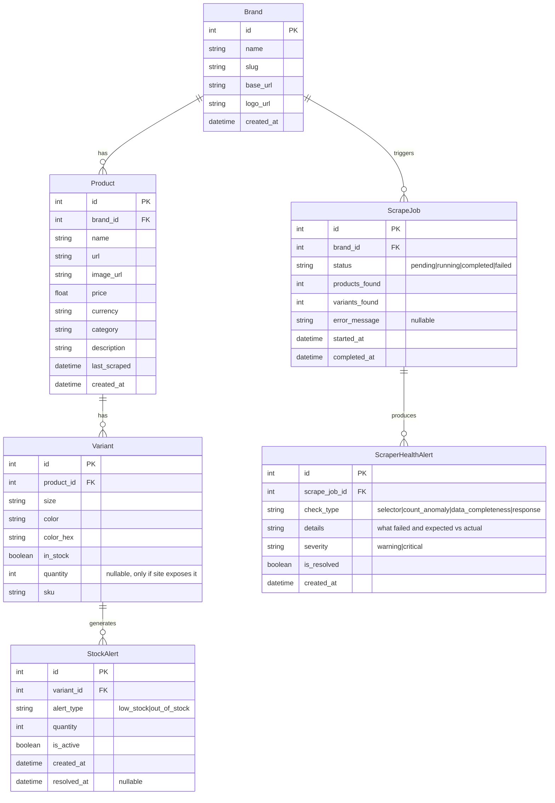

# InventoryScraper — Architecture & Implementation Plan

A Python-based web scraper dashboard for extracting product inventory data from luxury brand e-commerce websites. Scrape on-demand, view results in a polished dashboard, and export to CSV/Excel.

## Target Websites (6 brands)

| # | Brand | URL | Category | Anti-Bot Level |
|---|-------|-----|----------|---------------|
| 1 | On Running | on.com/en-us | Shoes/Apparel | Medium (JS-heavy) |
| 2 | Hoka | hoka.com/en/us | Shoes | High (blocks HTTP 406) |
| 3 | Acne Studios | acnestudios.com/us/en | Fashion | Medium (JS-rendered) |
| 4 | Maison Margiela | maisonmargiela.com/wx | Fashion | High (blocks HTTP 403) |
| 5 | Hourglass Cosmetics | hourglasscosmetics.com | Cosmetics | Low-Medium |
| 6 | Drunk Elephant | drunkelephant.com | Skincare | Low-Medium |

> [!IMPORTANT]
> Hoka and Maison Margiela actively block plain HTTP requests (406/403). All scrapers will use **Playwright** (headless browser) with stealth plugins to handle JS-rendered content and anti-bot protections uniformly.

---

## Tech Stack

| Layer | Technology | Rationale |
|-------|-----------|-----------|
| **Backend** | Python 3.11+ / FastAPI | Async support, lightweight, great for APIs |
| **Scraping** | Playwright (async) | Handles JS rendering, stealth mode, reliable |
| **Database** | SQLite + SQLAlchemy | Zero setup, handles thousands of products easily, migrateable later |
| **Frontend** | Vanilla HTML/CSS/JS | Lightweight, no build step, easy to migrate to React later |
| **Export** | openpyxl + csv | Excel and CSV export |

> [!NOTE]
> **SQLite capacity**: SQLite handles databases up to 281 TB and millions of rows. For 20 brands × ~500 products each = ~10,000 products with variants, SQLite is more than sufficient. When you're ready to deploy, we can migrate to PostgreSQL with minimal changes (SQLAlchemy abstracts this).

---

## Project Structure

```
InventoryScraper/
├── backend/
│   ├── main.py                    # FastAPI app entry point
│   ├── config.py                  # App configuration
│   ├── requirements.txt           # Python dependencies
│   │
│   ├── database/
│   │   ├── __init__.py
│   │   ├── db.py                  # DB engine, session management
│   │   └── models.py             # SQLAlchemy ORM models
│   │
│   ├── scrapers/
│   │   ├── __init__.py
│   │   ├── base_scraper.py       # Abstract base scraper class
│   │   ├── on_scraper.py         # On Running
│   │   ├── hoka_scraper.py       # Hoka
│   │   ├── acne_scraper.py       # Acne Studios
│   │   ├── margiela_scraper.py   # Maison Margiela
│   │   ├── hourglass_scraper.py  # Hourglass Cosmetics
│   │   └── drunk_elephant_scraper.py  # Drunk Elephant
│   │
│   ├── services/
│   │   ├── __init__.py
│   │   ├── scrape_service.py     # Orchestrates scraping jobs
│   │   ├── alert_service.py      # Stock alert detection & management
│   │   └── export_service.py     # CSV/Excel export logic
│   │
│   └── utils/
│       ├── __init__.py
│       ├── anti_detect.py        # User-agent rotation, random delays
│       └── proxy_manager.py      # Optional proxy rotation
│
├── frontend/
│   ├── index.html                # Single-page dashboard
│   ├── css/
│   │   └── styles.css            # Dark theme, polished design
│   └── js/
│       ├── app.js                # Main app logic
│       ├── api.js                # API client
│       └── components.js         # UI component renderers
│
├── data/                         # Created at runtime
│   └── inventory.db              # SQLite database
│
└── README.md
```

---

## Database Schema



### Key design decisions:
- **Variant** stores size/color/stock at the most granular level (e.g., "Size 9, Black, In Stock")
- **ScrapeJob** tracks every scrape run for history and debugging
- **StockAlert** is auto-generated after each scrape — any variant with quantity < 10 (configurable threshold) creates a `low_stock` alert; quantity = 0 or `in_stock = false` creates an `out_of_stock` alert
- Alerts are marked `is_active = true` until the next scrape resolves them (quantity goes back up)
- Products are **upserted** (update if URL matches, insert if new) so data stays current without duplicates

---

## Scraper Architecture

### Base Scraper (Abstract Class)

Every brand scraper inherits from `BaseScraper` which provides:

```python
class BaseScraper(ABC):
    """Shared logic for all brand scrapers"""
    
    # Anti-detection built in
    async def _get_page()        # Launch Playwright with stealth settings
    async def _random_delay()    # Random 2-5 second delays between actions
    async def _rotate_ua()       # Rotate User-Agent per request
    async def _apply_proxy()     # Apply proxy if configured
    
    # Template method pattern
    @abstractmethod
    async def get_product_links() -> list[str]    # Brand-specific: find all product URLs
    
    @abstractmethod
    async def parse_product(url) -> Product       # Brand-specific: extract product data
    
    async def scrape() -> list[Product]            # Shared: orchestrate full scrape
```

### Anti-Detection Strategy (10 Layers)

We'll implement a **multi-layered** defense to minimize detection risk. These techniques stack together — each one individually helps, but combined they make the scraper very hard to distinguish from a real user.

| # | Technique | Implementation | Risk it Mitigates |
|---|-----------|---------------|-------------------|
| 1 | **Playwright Stealth Plugin** | `playwright-stealth` patches `navigator.webdriver`, `HeadlessChrome` UA, and other automation markers automatically | Fingerprint-based detection |
| 2 | **User-Agent Rotation** | Pool of 30+ real browser UAs (Chrome/Firefox/Edge on Win/Mac), rotated per session | UA-based blocking |
| 3 | **Random Delays** | 2-6 seconds between page loads (gaussian distribution, not uniform — more human-like) | Rate-based detection |
| 4 | **Human-like Behavior** | Random viewport sizes, smooth scroll simulation, realistic mouse movement paths, varied typing speeds | Behavioral analysis |
| 5 | **Browser Fingerprint Spoofing** | Randomize `navigator.plugins`, `navigator.languages`, WebGL renderer, Canvas fingerprint, timezone per session | Advanced fingerprinting |
| 6 | **Cookie & Session Persistence** | Save/restore cookies between scrape sessions per brand — appear as a "returning visitor" | New-visitor flagging |
| 7 | **Request Interception** | Block tracking scripts (Google Analytics, Facebook Pixel, Cloudflare analytics) that could flag the session | Analytics-based detection |
| 8 | **Disable Automation Flags** | Launch with `--disable-blink-features=AutomationControlled` and similar Chrome flags | Chrome automation detection |
| 9 | **Rate Limiting** | Max 10 requests/minute per domain (configurable), with exponential backoff on 429/503 responses | Rate limit bans |
| 10 | **Proxy Support** | Optional proxy rotation via config file — supports HTTP/SOCKS5 proxies, ready when you get a proxy service | IP-based blocking |
| 11 | **Camoufox (Optional)** | Anti-detect Firefox fork, configurable per-scraper in `config.py`. Disabled by default — enable for aggressive sites | Advanced browser fingerprinting |

> [!NOTE]
> **Camoufox recommendation**: We'll include Camoufox support but keep it **disabled by default**. Playwright + stealth is sufficient for most sites. You can toggle it ON per-brand in the config if a specific site starts blocking. This avoids the extra overhead unless needed.

### Scraping Flow per Brand

```
1. Launch headless browser with stealth settings
2. Navigate to brand's product listing page(s)
3. Paginate / scroll to load all products
4. Collect all product URLs
5. For each product URL (with delays):
   a. Navigate to product page
   b. Extract: name, price, image, description, category
   c. Extract variants: sizes, colors, stock status
   d. Build Product + Variant objects
6. Upsert all data into SQLite
7. Run structure health check (compare selectors & product count)
8. Generate stock alerts for low/out-of-stock variants
9. Update ScrapeJob status
```

### Website Structure Change Detection

Luxury brand sites frequently redesign or update their HTML. To catch this early, every scraper includes a **health check system**:

| Check | How it Works | Alert Triggered When |
|-------|-------------|---------------------|
| **Selector Validation** | Each scraper defines expected CSS selectors (product name, price, etc.) and tests them on page load | Any critical selector returns 0 matches |
| **Product Count Anomaly** | Compare products found vs. last successful scrape | Count drops by >50% or is 0 |
| **Data Completeness** | Validate required fields (name, price) are non-empty | >20% of products have missing required fields |
| **Response Validation** | Check HTTP status and page content length | Non-200 status or page suspiciously small |

**When a structure change is detected:**
1. ScrapeJob is marked `status = "warning"` or `status = "failed"` depending on severity
2. A `ScraperHealthAlert` is created in the database with details on what broke
3. Dashboard shows a 🔧 **"Scraper Needs Attention"** banner with the affected brand
4. The alert includes: which selectors failed, expected vs actual product count, timestamp

```python
# Example: health check definition in each scraper
class OnScraper(BaseScraper):
    HEALTH_SELECTORS = {
        "product_name": "h1.product-title",
        "price": ".price-value",
        "size_options": ".size-selector option",
    }
```

---

## API Endpoints

| Method | Endpoint | Description |
|--------|----------|-------------|
| `GET` | `/api/brands` | List all configured brands with last scrape info |
| `POST` | `/api/scrape/{brand_slug}` | Start scraping a specific brand |
| `POST` | `/api/scrape/all` | Start scraping all brands |
| `GET` | `/api/scrape/status/{job_id}` | Check scrape job status |
| `GET` | `/api/scrape/history` | Scrape job history |
| `GET` | `/api/products` | List products (filterable by brand, category, stock status) |
| `GET` | `/api/products/{id}` | Get product with all variants |
| `GET` | `/api/alerts` | Get all active stock alerts (filterable by brand, alert type) |
| `PUT` | `/api/alerts/settings` | Get/update alert threshold (default: 10) |
| `GET` | `/api/health-alerts` | Get scraper health alerts (structure change notifications) |
| `GET` | `/api/export` | Export data as CSV or Excel (query param: `format=csv\|xlsx`) |
| `GET` | `/api/stats` | Dashboard stats (total products, brands, stock summary, active alerts count) |

The FastAPI backend also serves the frontend static files from `/`.

---

## Frontend Dashboard Design

### Dark theme, polished luxury feel — 4 main views:

**1. Dashboard Home**
- Top stats bar: Total Products | Brands Active | Items In Stock | ⚠️ Active Alerts | Last Scrape Time
- Brand cards grid — each card shows: brand logo/name, product count, alert count badge, last scrape time, "Scrape Now" button with loading spinner
- "Scrape All" master button
- Alert notification banner if there are active low stock alerts

**2. Products View**
- Filterable data table: Brand, Product Name, Category, Price, Colors, Sizes, Stock Status
- Search bar with live filtering
- Color chips showing available colors
- Stock badges (green = in stock, amber = low stock, red = out of stock)
- Click row to expand and see all variant details
- Export button (CSV / Excel dropdown)

**3. ⚠️ Stock Alerts View (NEW)**
- Dedicated section showing only low-stock and out-of-stock items
- Alert cards with: Product name, Brand, Variant (size/color), Current quantity, Alert type badge
- Filter by: Brand, Alert type (low stock / out of stock)
- Configurable threshold slider (default: quantity < 10 = low stock)
- Alert count summary: "X low stock, Y out of stock across Z brands"
- Quick link to product page on the original website
- Color-coded severity: 🟡 Amber for low stock (1-9), 🔴 Red for out of stock (0)

**4. Scrape History**
- Timeline of past scrape jobs with status, duration, products scraped
- Error details for failed scrapes

### Design Tokens
- **Background**: `#0a0a0f` (near black) with `#12121a` cards
- **Accent**: `#7c5cfc` (purple) + `#00d4aa` (teal) gradient
- **Alert colors**: `#f59e0b` (amber/low stock) + `#ef4444` (red/out of stock)
- **Typography**: Inter (Google Fonts)
- **Border radius**: 12px for cards, 8px for buttons
- **Glass morphism**: Subtle backdrop-blur on cards

---

## Implementation Order

We will build in this order to always have something testable:

1. **Backend skeleton** — FastAPI app, config, database models, migrations
2. **Anti-detection utilities** — UA rotation, delays, proxy support
3. **Base scraper** — Abstract class with shared logic
4. **First 2 scrapers** — On Running + Hourglass (one shoes, one cosmetics — to validate the architecture works across categories)
5. **API endpoints** — All REST endpoints
6. **Frontend dashboard** — Full UI with all 3 views
7. **Remaining 4 scrapers** — Hoka, Acne Studios, Maison Margiela, Drunk Elephant
8. **Export feature** — CSV/Excel export
9. **Polish** — Error handling, loading states, edge cases

---

## Verification Plan

### Automated Testing

1. **Backend API tests** — After building the API layer, run:
   ```bash
   cd c:\Users\Sud\Desktop\InventoryScraper
   python -m pytest backend/tests/ -v
   ```
   Tests will cover: database CRUD, API endpoint responses, export format validation.

2. **Scraper smoke tests** — Test each scraper against live sites:
   ```bash
   python -m pytest backend/tests/test_scrapers.py -v --timeout=120
   ```
   Each test scrapes a single product page and validates the extracted data structure.

### Manual Verification (Browser-based)

1. **Start the server** (`python backend/main.py`) and open `http://localhost:8000`
2. **Dashboard loads** — Verify all 6 brand cards appear with correct names/logos
3. **Trigger scrape** — Click "Scrape Now" on On Running, verify:
   - Loading spinner appears
   - Products populate the table after completion
   - Each product shows name, price, colors, sizes, stock status
4. **Filters work** — Filter by brand, search by product name, filter by stock status
5. **Export works** — Click Export CSV, open the file, verify data matches the dashboard
6. **Scrape history** — View scrape history, verify completed job appears with correct stats

> [!NOTE]
> Since scraping live websites is inherently flaky (sites change layouts, rate limits kick in), the first run of each scraper may need adjustments. We'll build and test iteratively — 2 scrapers first, then the remaining 4.

---

## User Review Required

> [!WARNING]
> **Scraping limitations**: Luxury brand sites frequently change their HTML structure and have aggressive bot detection. Scrapers will need periodic maintenance when sites update. The architecture is designed to make updating individual scrapers easy without affecting others.
